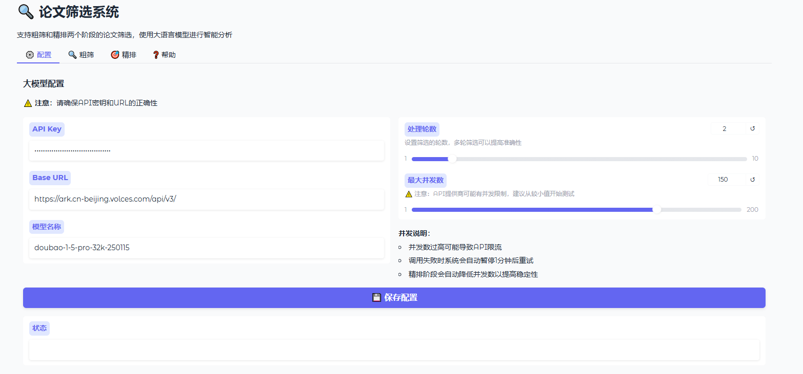
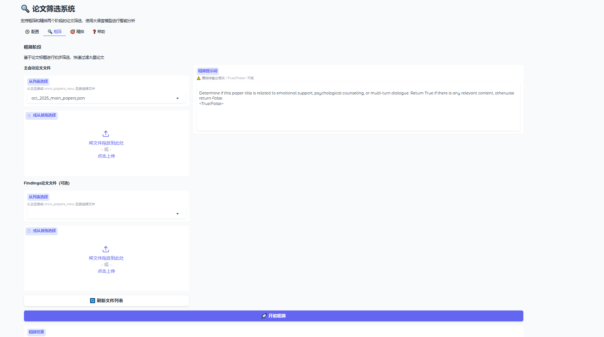

# Thesis Crawling and Filtering System (论文爬取与智能筛选系统)

<div align="center">

[](https://www.python.org/)
[](https://www.gradio.app/)
[](https://opensource.org/licenses/MIT)

</div>

---

**中文** | [English](./README_EN.md)

 > 面对每日数以百计的新发表论文，研究人员如何才能不错过关键研究，同时又不被信息洪流淹没？本项目旨在解决这一痛点。

这是一个为科研人员设计的自动化、智能化的学术论文处理工作流。它能够自动从arXiv上抓取符合特定关键词的最新论文，并通过一个简洁的Web界面，利用大型语言模型（LLM）的强大语义理解能力，帮助用户进行两阶段、可定制化的深度筛选，从而在海量文献中快速、精准地定位到最具价值的研究成果。

## 🌟 核心功能 (Key Features)

- **🤖 全自动论文获取**: 基于预设关键词，通过 `arxiv` API 自动爬取并下载最新的学术论文，支持全量历史数据抓取与每日增量更新。

- **🖥️ 优雅的可视化界面**: 采用 Gradio 构建，提供了一个直观、友好的Web用户界面，无需任何命令行操作即可完成所有筛选任务。

-   **🎯 两阶段深度筛选**:
    -   **粗筛 (Coarse Filtering)**: 基于论文**标题**进行快速筛选，迅速剔除大量不相关文献。
    -   **精筛 (Fine Filtering)**: 结合**标题与摘要**进行深度语义分析，确保筛选结果的高度相关性。
    
- **🔧 无代码逻辑定制**: 筛选的核心标准完全由**自然语言提示词 (Prompt)** 控制。用户无需修改任何复杂代码，只需编辑配置文件中的几句英文描述，即可将系统无缝切换至任何新的研究领域。

- **🛡️ 鲁棒的多轮验证**: 为确保不错过任何一篇潜在相关论文，系统会对每批数据进行多轮（可配置）独立的LLM判断，并综合所有结果，极大提升了召回率。

- **📊 清晰的结果输出**: 每次筛选后，系统都会生成结构化的 `.json` 结果文件，并提供清晰的日志和统计数据，方便用户进行后续分析。

  

## 🚀 快速上手 (Quick Start)

您只需遵循以下三个步骤，即可在本地运行并体验本系统的完整功能。

### 1. 环境配置 (Setup)

首先，确保您的电脑已安装 `Python 3.8+` 和 `Git`。

```bash
# 1. 克隆本仓库到您的本地设备
git clone [https://github.com/Takethelead1902/Thesis_Crawling_and_Filtering_System.git](https://github.com/Takethelead1902/Thesis_Crawling_and_Filtering_System.git)

# 2. 进入项目目录
cd Thesis_Crawling_and_Filtering_System

# 3. (推荐) 创建并激活一个Python虚拟环境
python -m venv venv
# Windows
# venv\Scripts\activate
# macOS / Linux
# source venv/bin/activate

# 4. 安装所有必需的依赖库
pip install -r requirements.txt
```

### 2. 配置API密钥 (API Configuration)

本系统的筛选功能依赖于大型语言模型（LLM）的API。

1. 在项目根目录下，找到 `config.json.example` 文件。
2. **复制**该文件并**重命名**为 `config.json`。
3. 使用文本编辑器打开 `config.json` 并填入您的个人信息：

```
{
    "api_key": "sk-YOUR_API_KEY_HERE",
    "base_url": "https://ark.cn-beijing.volces.com/api/v3/",
    "model": "doubao-1-5-pro-32k-250115",
    "rounds": 3,
    "max_concurrent": 50
}
```

- `api_key`: **必需**。您的LLM服务提供商的API密钥。（这个需要您去例如百炼、火山引擎这种模型云平台去申请一下）
- `base_url`: **必需**。API的请求地址。（到了申请的地方你可以直接问相关平台的ai助手你调用的模型名称对应的api_url是怎么样的）
- `model`: 您希望使用的模型名称。
- `rounds`: 筛选时进行的轮次，推荐 `2` 或 `3` 以保证结果的全面性。
- `max_concurrent`: 并发请求数量，请根据您的API速率限制进行调整。

### 3. 启动应用 (Launch)

一切准备就绪！在您的终端中运行以下命令：

```
python filtering_app_after_crawling_arxiv.py
```

执行后，浏览器将自动打开一个本地网址 (如 `http://127.0.0.1:7860`)，您将看到本系统的操作界面。


## 📖 使用指南 (How to Use)

### 选项 A：体验筛选功能 (使用自带样本)

我们已为您准备好了样本数据，让您可以立即体验核心的筛选功能。

1. **启动应用** (如上一步所示)。
2. 在Web界面中，`请选择要筛选的JSON文件` 下拉菜单会自动加载项目中的所有 `.json` 文件。
3. 选择 `arxiv_papers_new/arxiv_2025_08_llm_papers.json`，这是一个原始的、未经筛选的论文数据样本。
4. 点击 **`执行粗筛`** 按钮，并等待任务完成。完成后，项目根目录将生成一个 `_coarse_final.json` 后缀的新文件。
5. 点击界面右上角的 **`🔄 刷新文件列表`** 按钮。
6. 在下拉菜单中，选择上一步生成的 `_coarse_final.json` 文件。
7. 点击 **`执行精筛`** 按钮，等待任务完成。最终，您将得到一个 `_fine_final.json` 后缀的精选论文列表文件。

### 选项 B：爬取您自己的论文数据

如果您想针对特定的主题进行筛选，可以先运行爬虫脚本。

1. **配置关键词**: 打开 `arxiv_crawler.py` 文件，在 `Config` 类中修改 `KEYWORDS` 列表，填入您感兴趣的研究方向，例如，autonomous driving。

   ```
   # in arxiv_crawler.py
   class Config:
       KEYWORDS = [
           "your keyword 1", 
           "your keyword 2"
       ]
   ```

2. 一定要到这个 `arxiv_crawler.py` 知道爬取论文的命名要求，**命名要根据你的爬取主题更改爬取论文的保存文件的文件名！**

3. **运行爬虫**: 在终端中执行以下命令。

   ```
   python arxiv_crawler.py
   ```

4. **说明**:

   - 爬虫脚本会在项目根目录下自动创建 `arxiv_papers_new/` 文件夹来存放所有爬取结果。
   - 该文件夹其中的运行时文件（如 `last_crawl_time.json`）已被 `.gitignore` 规则忽略，不会同步到GitHub仓库中，现在该文件下只保留了一个爬取的原始文件作为样例。
   - 爬取完成后，回到**选项 A** 的步骤，刷新Web界面并选择您刚刚爬取的新文件即可开始筛选。

### ✨ 定制您的专属筛选助手 (Customize Your Filter)

这是本项目的精髓所在。您可以完全通过自然语言来定义筛选标准。

1. 打开 `filtering_app_after_crawling_arxiv.py` 文件。
2. 定位到文件顶部的 `COARSE_SYSTEM_PROMPT` 和 `FINE_SYSTEM_PROMPT` 两个变量。
3. **修改这两个字符串的内容**，以描述您新的筛选要求。例如，从情感支持领域切换到自动驾驶领域：
   ```
   # 原Prompt (情感支持)
   COARSE_SYSTEM_PROMPT = """
   Determine if this paper title is related to emotional support, psychological counseling, or multi-turn dialogue. Return True if it is, otherwise return False.
   <True/False>
   """
   
   # 修改后的Prompt (自动驾驶)
   COARSE_SYSTEM_PROMPT = """
   Determine if the paper's title is about autonomous driving or vehicle perception. If it mentions topics like LiDAR, sensor fusion, path planning, or self-driving, return True. Otherwise, return False.
   <True/False>
   """
   ```
4. 保存文件并**重启** `filtering_app_after_crawling_arxiv.py` 脚本，您的筛选系统现在就以全新的标准工作了！


## 🖼️ 界面截图 (Screenshots)

### 1. 后台爬取arxiv您对应需求下的论文的运行界面


### 2. 论文筛选系统---配置界面



### 3. 论文筛选系统---粗筛界面



### 4. 论文筛选系统---精排界面


### 5.论文筛选系统---帮助界面


## 📂 项目结构与数据说明 (Project Structure & Data)

```
/
├── 📂 arxiv_papers_new/                     # 存放爬取论文的目录
│   └── 📜 arxiv_2025_08_llm_papers.json #  -> [输入] 原始的、未筛选的爬取数据
│
├── 📜 arxiv_2025_08_llm_papers_coarse_final.json  # -> [输出] 对原始样本粗筛后的结果
├── 📜 arxiv_2025_08_llm_papers_coarse_final_fine_final.json # -> [输出] 精筛后的最终结果
├── 📜 acl_*.json                        # -> [输出] acl会议论文main以及findingS的未筛选原始内容(2024\2025,您可以用这个数据做实验测试筛选系统)
│
├── 🐍 arxiv_crawler.py                  # 核心脚本：arXiv 论文爬虫
├── 🐍 filtering_app_after_crawling_arxiv.py # 核心脚本：Gradio Web 应用
│
├── 📄 config.json.example             # API配置示例文件，需重命名为 config.json
├── 📄 requirements.txt                # Python 依赖包列表
├── 📄 .gitignore                        # Git 忽略规则文件
├── 📄 LICENSE                         # MIT 开源许可证
└── 📄 README.md                         # 本说明文档
```

