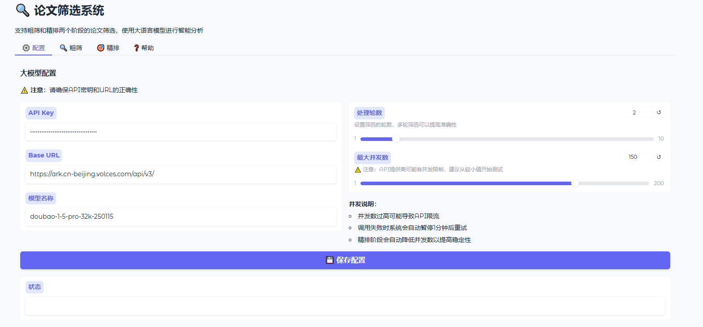
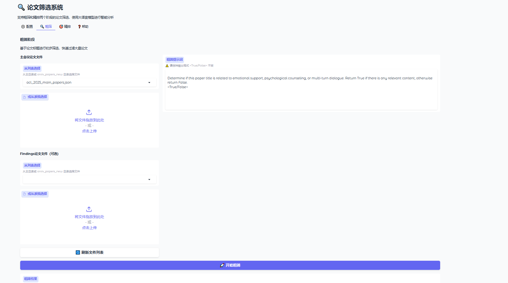
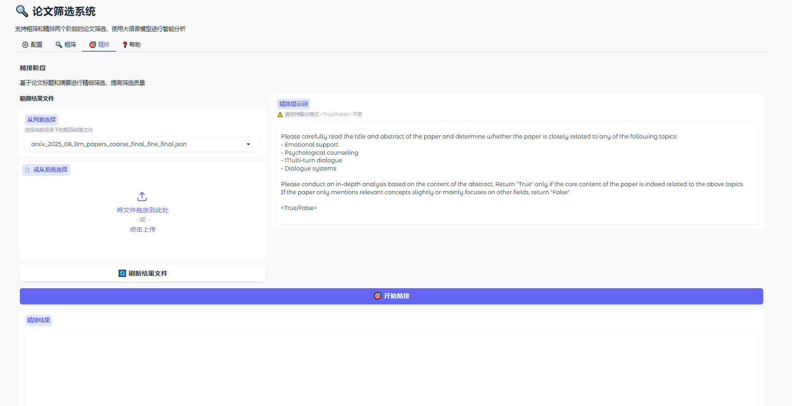
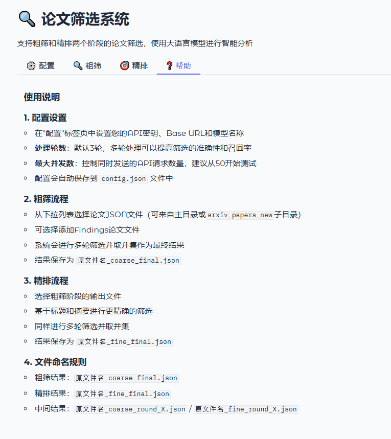

# Thesis Crawling and Filtering System

<div align="center">

[](https://www.python.org/)
[](https://www.gradio.app/)
[](https://opensource.org/licenses/MIT)

</div>

---

[Chinese](./README.md) | **English**

> Faced with hundreds of new papers published daily, how can researchers avoid missing key studies without being overwhelmed by the flood of information? This project aims to solve this pain point.

This is an automated and intelligent academic paper processing workflow designed for researchers. It can automatically crawl the latest papers from arXiv based on specified keywords and provides a concise web interface that leverages the powerful semantic understanding of Large Language Models (LLMs) to help users perform two-stage, customizable deep filtering. This allows for the quick and accurate identification of the most valuable research outcomes from a massive volume of literature.


## 🌟 Key Features

- **🤖 Fully Automated Paper Retrieval**: Automatically crawls and downloads the latest academic papers from the arXiv API based on a preset list of keywords, supporting both full historical data scraping and daily incremental updates.

- **🖥️ Elegant Visual Interface**: Built with Gradio, it provides an intuitive and friendly web user interface, allowing all filtering tasks to be completed without any command-line operations.

- **🎯 Two-Stage Deep Filtering**:
    - **Coarse Filtering**: Performs a quick screening based on paper **titles** to rapidly eliminate a large number of irrelevant documents.
    - **Fine-Grained Filtering**: Conducts a deeper semantic analysis by combining **titles and abstracts** to ensure a high degree of relevance in the filtered results.
    
- **🔧 No-Code Logic Customization**: The core filtering logic is controlled entirely by **natural language prompts**. Users can seamlessly switch the system to a new research area by simply editing a few English descriptions in the configuration file, without modifying any complex code.

- **🛡️ Robust Multi-Round Validation**: To ensure no potentially relevant paper is missed, the system performs multiple rounds (configurable) of independent LLM judgments on each batch of data and consolidates all results, significantly improving the recall rate.

- **📊 Clear Result Output**: After each filtering stage, the system generates structured `.json` result files and provides clear logs and statistics for convenient subsequent analysis by the user.

    

## 🚀 Quick Start

You can run and experience the full functionality of this system locally by following these three steps.

### 1. Environment Setup

First, ensure that your computer has `Python 3.8+` and `Git` installed.

```bash
# 1. Clone this repository to your local machine
git clone [https://github.com/Takethelead1902/Thesis_Crawling_and_Filtering_System.git](https://github.com/Takethelead1902/Thesis_Crawling_and_Filtering_System.git)

# 2. Navigate to the project directory
cd Thesis_Crawling_and_Filtering_System

# 3. (Recommended) Create and activate a Python virtual environment
python -m venv venv
# Windows
# venv\Scripts\activate
# macOS / Linux
# source venv/bin/activate

# 4. Install all required dependencies
pip install -r requirements.txt
```

### 2. Configure API Key


The filtering functionality of this system relies on a Large Language Model (LLM) API.

1. In the project's root directory, find the `config.json.example` file.
2. **Copy** and **rename** this file to `config.json`.
3. Open `config.json` with a text editor and fill in your personal information:

JSON

```
{
    "api_key": "sk-YOUR_API_KEY_HERE",
    "base_url": "[https://ark.cn-beijing.volces.com/api/v3/](https://ark.cn-beijing.volces.com/api/v3/)",
    "model": "doubao-1-5-pro-32k-250115",
    "rounds": 3,
    "max_concurrent": 50
}
```

- `api_key`: **Required**. Your API key from an LLM service provider. (You may need to apply for this from a model cloud platform like Baidu AI Cloud, Volcano Engine, etc.).
- `base_url`: **Required**. The API request address. (Once you have access, you can ask the platform's AI assistant for the correct API URL for your chosen model).
- `model`: The name of the model you wish to use.
- `rounds`: The number of filtering rounds to perform. `2` or `3` are recommended to ensure comprehensive results.
- `max_concurrent`: The number of concurrent requests. Adjust this according to your API's rate limits.


### 3. Launch the Application

Everything is ready! Run the following command in your terminal:

Bash

```
python filtering_app_after_crawling_arxiv.py
```

After execution, a local URL (usually `http://127.0.0.1:7860`) will automatically open in your browser, where you will see the system's interface.


## 📖 How to Use

### Option A: Experience the Filtering Feature (Using the Provided Sample)


We have prepared sample data for you to immediately experience the core filtering functionality.

1. **Launch the application** (as in the previous step).
2. In the web interface, the `Please select the JSON file to filter` dropdown menu will automatically load all `.json` files in the project.
3. Select `arxiv_papers_new/arxiv_2025_08_llm_papers.json`, which is a sample of raw, unfiltered paper data.
4. Click the **`Execute Coarse Filtering`** button and wait for the task to complete. A new file with a `_coarse_final.json` suffix will be generated in the project's root directory.
5. Click the **`🔄 Refresh File List`** button in the upper right corner of the interface.
6. From the dropdown menu, select the `_coarse_final.json` file generated in the previous step.
7. Click the **`Execute Fine-Grained Filtering`** button and wait for the task to complete. You will finally get a curated list of papers in a file with a `_fine_final.json` suffix.


### Option B: Crawl Your Own Paper Data


If you want to filter papers on a specific topic, you can run the crawler script first.

1. **Configure Keywords**: Open the `arxiv_crawler.py` file and modify the `KEYWORDS` list in the `Config` class to include your topics of interest, for example, "autonomous driving".

   Python

   ```
   # in arxiv_crawler.py
   class Config:
       KEYWORDS = [
           "your keyword 1", 
           "your keyword 2"
       ]
   ```

2. It is important to modify the `arxiv_crawler.py` script to change the output filename based on your crawling topic!

3. **Run the Crawler**: Execute the following command in your terminal.

   Bash

   ```
   python arxiv_crawler.py
   ```

4. **Notes**:

   - The crawler script will automatically create an `arxiv_papers_new/` folder in the project root to store all crawling results.
   - Runtime files within this folder (like `last_crawl_time.json`) are ignored by the `.gitignore` rule and will not be synced to the GitHub repository. Currently, this folder only contains one raw crawled file as an example.
   - After crawling is complete, return to the steps in **Option A**, refresh the web interface, and you can select the newly crawled file to begin filtering.

### ✨ Customize Your Personal Filtering Assistant

This is the essence of the project. You can define the filtering criteria entirely through natural language.

1. Open the `filtering_app_after_crawling_arxiv.py` file.

2. Locate the `COARSE_SYSTEM_PROMPT` and `FINE_SYSTEM_PROMPT` variables at the top of the file.

3. **Modify the content of these two strings** to describe your new filtering requirements. For example, to switch from the emotional support domain to autonomous driving:

   Python

   ```
   # Original Prompt (Emotional Support)
   COARSE_SYSTEM_PROMPT = """
   Determine if this paper title is related to emotional support, psychological counseling, or multi-turn dialogue. Return True if it is, otherwise return False.
   <True/False>
   """
   
   # Modified Prompt (Autonomous Driving)
   COARSE_SYSTEM_PROMPT = """
   Determine if the paper's title is about autonomous driving or vehicle perception. If it mentions topics like LiDAR, sensor fusion, path planning, or self-driving, return True. Otherwise, return False.
   <True/False>
   """
   ```

4. Save the file and **restart** the `filtering_app_after_crawling_arxiv.py` script. Your filtering system will now operate under the new criteria!


## 🖼️ Screenshots

### 1. Backend Crawler Running Interface


### 2. Paper Filtering System --- Configuration Interface




### 3. Paper Filtering System --- Coarse Filtering Interface



### 4. Paper Filtering System --- Fine-Grained Filtering Interface



### 5. Paper Filtering System --- Help Interface





## 📂 Project Structure & Data

```
/
├── 📂 arxiv_papers_new/                     # Directory for storing crawled papers
│   └── 📜 arxiv_2025_08_llm_papers.json #  -> [Input] Raw, unscreened crawled data
│
├── 📜 arxiv_2025_08_llm_papers_coarse_final.json  # -> [Output] Result after coarse filtering the raw sample
├── 📜 arxiv_2025_08_llm_papers_coarse_final_fine_final.json # -> [Output] Final result after fine-grained filtering
├── 📜 acl_*.json                        # -> [Output] Unfiltered raw content of ACL main and findings papers (2024/2025, you can use this data for experiments)
│
├── 🐍 arxiv_crawler.py                  # Core script: arXiv paper crawler
├── 🐍 filtering_app_after_crawling_arxiv.py # Core script: Gradio Web Application
│
├── 📄 config.json.example             # API configuration example file, must be renamed to config.json
├── 📄 requirements.txt                # List of Python dependencies
├── 📄 .gitignore                        # Git ignore configuration file
├── 📄 LICENSE                         # MIT License
└── 📄 README.md                         # This documentation file
```